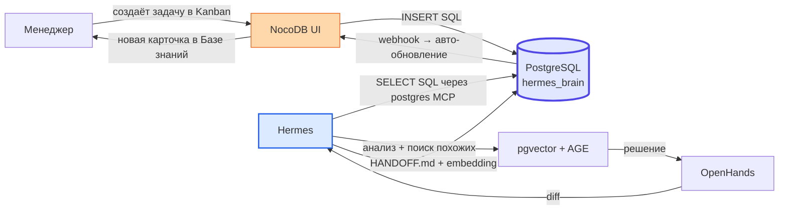
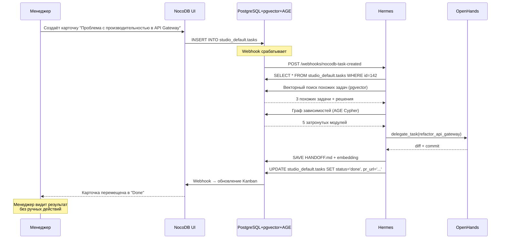

# NocoDB — приборная панель для человека

> Содержание: переосмысленная роль NocoDB в v2.0 — только UI для людей (Kanban, CRM, формы), синхронизация с мозгом PostgreSQL, двунаправленный обмен данными, настройка веб-UI.

## 1. Переосмысленная роль

В версии 1.0 NocoDB играл двойную роль: и приборная панель для человека, и «мозг» для AI-агента. Практика показала, что эта универсализация — архитектурная ошибка. NocoDB прекрасен как low-code/no-code платформа для создания CRUD-приложений с веб-интерфейсом, ориентированным на визуальное восприятие. Но его MCP-сервер нестабилен (`Session terminated`, `404 Not Found`), JWT-токены истекают каждые 10 часов, а внутренняя SQLite-база `noco.db`, скрытая в Docker-томе, делала ручной сброс паролей через `npx nocodb user:reset-password` или прямой `psql` рутиной. Использование NocoDB как RAG-системы — это «использование инструмента не по назначению».

В версии 2.0 NocoDB **понижен до приборной панели**. Он больше не является долговременной памятью Hermes, не предоставляет MCP-сервер для агента, не хранит векторные эмбеддинги и не выполняет семантический поиск. Эти функции перешли к PostgreSQL с расширениями pgvector и Apache AGE (см. [docs/04-convergent-database.md](04-convergent-database.md)). NocoDB просто подключается к тому же PostgreSQL как источник данных и предоставляет человеку удобный веб-интерфейс: Kanban-доски, формы, CRM, дашборды.

Это разделение ответственности использует сильные стороны каждой технологии там, где они наиболее ценны. NocoDB берёт на себя нагрузку по предоставлению удобного интерфейса для людей, а PostgreSQL обеспечивает «мозг» для AI-агента с мощным, быстрым и конвергентным механизмом для хранения и извлечения знаний. Двухкомпонентная архитектура обеспечивает гибкость, надёжность и масштабируемость.

## 2. Что NocoDB делает в v2.0

### 2.1. Управление проектами (Kanban)

NocoDB создаёт Kanban-доски на основе таблицы `studio_<tenant>.tasks`. Менеджер видит карточки задач, перетаскивает их между колонками «To Do / In Progress / Review / Done». Каждое изменение — это `UPDATE studio_<tenant>.tasks SET status = ...` в PostgreSQL. Hermes видит это изменение мгновенно (он читает ту же таблицу через postgres MCP).

### 2.2. CRM и учёт клиентов

Таблицы клиентов, проектов, спецификаций, историй взаимодействий. NocoDB предоставляет формы для ввода данных, галереи для просмотра, календари для отслеживания сроков. Все данные хранятся в PostgreSQL и доступны Hermes.

### 2.3. Технические спецификации

Структурированные таблицы требований к ПО, API-схем, конфигураций. Менеджер может создать таблицу «API Endpoints» с колонками: method, path, description, auth_required, rate_limit. Эти данные становятся доступны Hermes через postgres MCP — он может ссылаться на них при генерации кода.

### 2.4. Визуализация данных

NocoDB предоставляет несколько типов представлений:
- **Grid** — классическая таблица (как Excel)
- **Gallery** — карточки с изображениями
- **Kanban** — доска с колонками
- **Calendar** — события по датам
- **Form** — форма для ввода

Дашборды агрегируют данные из нескольких таблиц: например, «Количество задач по статусам», «Стоимость loop по неделям», «Топ-5 агентов по токенам».

## 3. Что NocoDB больше НЕ делает в v2.0

| Функция | В v1.0 | В v2.0 |
|---------|--------|--------|
| Долговременная память Hermes | ✅ NocoDB | ❌ → PostgreSQL + pgvector |
| MCP-сервер для агента | ✅ NocoDB MCP | ❌ → postgres MCP |
| Хранение векторных эмбеддингов | ✅ (попытка) | ❌ → pgvector внутри PostgreSQL |
| Семантический поиск | ✅ (попытка) | ❌ → `<=>` оператор pgvector |
| Графы зависимостей | ❌ | ❌ → Apache AGE внутри PostgreSQL |
| JWT-аутентификация для API | ✅ каждые 10 часов | ❌ → Bearer token для UI-only |
| Хранение метаданных в SQLite | ✅ noco.db | ❌ → PostgreSQL (NC_DB=pg://...) |

## 4. Конфигурация

### 4.1. Подключение к PostgreSQL

```yaml
# docker-compose.yml
nocodb-app:
  image: nocodb/nocodb:latest
  container_name: nocodb-web-ui
  environment:
    NC_DB: "pg://postgres-db:5432/hermes_brain"  # та же БД, что у Hermes
    NC_DB_USER: ${POSTGRES_USER}
    NC_DB_PASSWORD: ${POSTGRES_PASSWORD}
    NC_AUTH_JWT_SECRET: ${NC_AUTH_JWT_SECRET}
    NC_PUBLIC_URL: "http://localhost:8080"
    NC_DISABLE_TELEMETRY: "true"
    NC_TRY: "false"  # отключить demo-данные
```

**Ключевое:** `NC_DB=pg://postgres-db:5432/hermes_brain` — NocoDB подключается к той же БД `hermes_brain`, что и Hermes. Это обеспечивает единую точку истины.

### 4.2. Переменные окружения

| Переменная | Описание | Default |
|-----------|----------|---------|
| `NC_DB` | URL подключения к PostgreSQL | — |
| `NC_DB_USER` | Пользователь PostgreSQL | — |
| `NC_DB_PASSWORD` | Пароль PostgreSQL | — |
| `NC_AUTH_JWT_SECRET` | Секрет для JWT (для UI-аутентификации) | — |
| `NC_PUBLIC_URL` | Публичный URL UI | http://localhost:8080 |
| `NC_DISABLE_TELEMETRY` | Отключить телеметрию | true |
| `NC_TRY` | Demo-данные | false |

## 5. Двунаправленная синхронизация с мозгом

NocoDB и PostgreSQL образуют **замкнутый цикл знаний**:



### 5.1. Чтение данных из PostgreSQL

NocoDB подключается к PostgreSQL и автоматически обнаруживает все таблицы в схеме `public` и `studio_*`. Менеджер видит:
- `public.skills` — библиотека навыков Hermes
- `public.handoff_documents` — векторная память HDD
- `studio_default.tasks` — задачи
- `studio_default.loop_runs` — история прогонов loop
- `studio_default.projects` — проекты

NocoDB автоматически генерирует REST API для каждой таблицы, но этот API **не используется Hermes** — он работает через postgres MCP напрямую.

### 5.2. Запись данных в PostgreSQL

Менеджер создаёт задачу через Kanban-форму NocoDB. NocoDB выполняет `INSERT INTO studio_default.tasks (...)`. Hermes видит новую задачу мгновенно — при следующем запросе через postgres MCP.

### 5.3. Автоматическое обогащение

После успешного решения задачи Hermes генерирует HANDOFF.md и сохраняет его в `public.handoff_documents` с векторным эмбеддингом. NocoDB можно настроить на автоматическое отображение новых handoff-документов на отдельной доске «База знаний» — менеджер видит, чему научился агент.

### 5.4. Webhooks NocoDB

NocoDB поддерживает webhooks для событий `after.insert`, `after.update`, `after.delete`. Это позволяет автоматически уведомлять Hermes при изменении данных через UI:

```bash
# Регистрация webhook: уведомлять Hermes при новой задаче
curl -X POST "http://localhost:8080/api/v2/db/virtual/hermes_brain/hook" \
  -H "xc-token: $NOCODB_API_TOKEN" \
  -H "Content-Type: application/json" \
  -d '{
    "event": "after.insert",
    "model_name": "studio_default_tasks",
    "url": "http://hermes:8081/webhooks/nocodb-task-created",
    "headers": "{\"X-Webhook-Source\": \"nocodb\"}"
  }'
```

Hermes получает webhook и может автоматически делегировать задачу OpenHands.

## 6. Пример сценария взаимодействия



## 7. Настройка NocoDB при первом запуске

### 7.1. Создание admin-аккаунта

После запуска откройте http://localhost:8080. Создайте admin-аккаунт (email + пароль). Этот аккаунт используется только для управления NocoDB через UI — Hermes не использует NocoDB admin-аккаунт.

### 7.2. Создание проекта

1. **New Project → Create**
2. **Project Name:** `Studio Dashboard`
3. **Database Type:** PostgreSQL
4. **Connection:**
   - Host: `postgres-db`
   - Port: `5432`
   - User: `nocodb_user`
   - Password: `<из .env>`
   - Database: `hermes_brain`
5. NocoDB автоматически обнаружит все таблицы в схемах `public` и `studio_*`.

### 7.3. Создание Kanban-доски

1. Выберите таблицу `studio_default.tasks`
2. **Views → New View → Kanban**
3. **Grouping field:** `status`
4. Колонки: `open`, `in_progress`, `review`, `done`, `escalated`
5. **Card fields:** `title`, `priority`, `assignee_agent`, `created_at`

### 7.4. Создание дашборда

1. **Dashboards → New Dashboard**
2. Добавьте виджеты:
   - **Pie chart:** «Задачи по статусам» (таблица `studio_default.tasks`, группировка по `status`)
   - **Bar chart:** «Стоимость loop по неделям» (таблица `studio_default.loop_runs`, группировка по `DATE_TRUNC('week', run_started)`, агрегация `SUM(cost_usd)`)
   - **Number:** «Активных loop» (COUNT из `studio_default.loop_registry WHERE enabled=true`)
   - **Table:** «Последние 10 HANDOFF.md» (таблица `public.handoff_documents`, сортировка по `created_at DESC`)

### 7.5. Генерация API-токена (опционально)

Если нужны webhooks или внешняя интеграция:
1. **Project Settings → Access Tokens**
2. **Create New Token**, описание `studio-webhooks`
3. Скопируйте токен (формат `st_xxxxxxxx`)
4. Используйте в заголовке `xc-token: <token>` для webhook-запросов

## 8. Миграция с v1.0

Если у вас уже есть NocoDB с данными в `studio_db` (v1.0), миграция на v2.0:

```bash
# 1. Backup старой БД
docker exec nocodb-postgres-db pg_dumpall -U nocodb_user | gzip > \
  ~/syncthing-host/backup/studio_db-v1-backup-$(date +%Y-%m-%d).sql.gz

# 2. Выполнение миграционного SQL (перенос данных из studio_db в hermes_brain)
docker exec -i nocodb-postgres-db psql -U nocodb_user -d hermes_brain < \
  /home/studio/studio/examples/sql/06-migration-from-nocodb.sql

# 3. Удаление старого MCP-подключения в Hermes (если было)
hermes mcp remove nocodb-mcp

# 4. Перенастройка NocoDB на hermes_brain (если ещё не сделано)
# Обновить NC_DB в docker-compose.yml
docker compose up -d nocodb-app --force-recreate

# 5. Проверка: NocoDB видит таблицы public.skills, public.handoff_documents
```

Готовый скрипт — `scripts/08-migrate-nocodb-to-postgres.sh`.

## 9. Что дальше

- **Эталонный API/MCP референс** — [docs/06-api-mcp-reference.md](06-api-mcp-reference.md)
- **Hermes Agent** — [docs/07-hermes-agent.md](07-hermes-agent.md)
- **Оркестрация знаний** — [docs/08-knowledge-orchestration.md](08-knowledge-orchestration.md)
