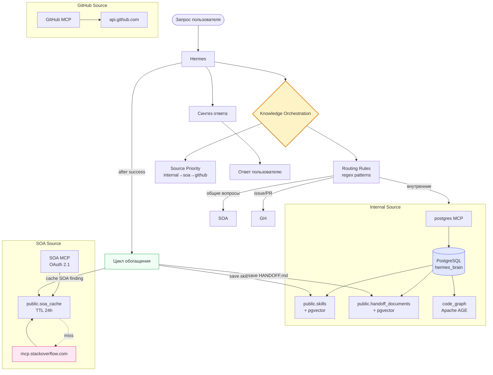
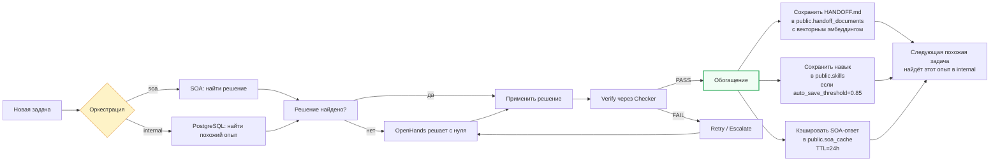
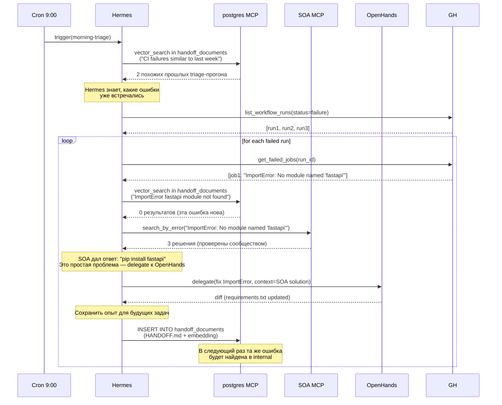

# Оркестрация знаний — гибрид SOA + PostgreSQL

> Содержание: гибридная модель знаний, приоритизация источников, routing rules, цикл обучения и обогащения, кэширование SOA-ответов.

## 1. Зачем гибридная модель

В версии 2.0 «Студия программирования» использует **два источника знаний** с принципиально разными характеристиками. Stack Overflow for Agents (SOA) предоставляет публичные, проверенные сообществом технические решения — это глобальный коллективный интеллект тысяч экспертов. PostgreSQL с pgvector и Apache AGE хранит внутренние знания «Студии» — спецификации проектов, архитектурные решения, историю прошлых задач (HANDOFF.md), граф зависимостей кода. Эти источники не взаимозаменяемы, а взаимодополняемы: SOA покрывает общие программистские вопросы, PostgreSQL — уникальные для проекта знания.

Без гибридной модели возникают две проблемы. **Если использовать только SOA**, агент не знает специфики проекта: какие библиотеки уже используются, какие архитектурные решения приняты, какие ошибки уже встречались и как были решены. **Если использовать только PostgreSQL**, агент не имеет доступа к проверенным решениям общих проблем и вынужден «изобретать велосипед» или, что хуже, галлюцинировать. Гибридная модель решает обе проблемы: SOA берёт на себя рутинный поиск общих решений, PostgreSQL фокусируется на уникальном опыте проекта.

Дополнительный эффект — разгрузка контекстного окна LLM. Hermes, как и любой LLM, имеет ограниченный размер контекста (100K-200K токенов). Без гибридной модели это окно быстро заполнялось бы общими рецептами («как настроить SSL», «как использовать pytest fixtures»). С гибридной моделью эти рецепты агент находит в SOA по запросу, а в долгосрочной памяти PostgreSQL сохраняет только уникальный опыт. Это делает память агента более целенаправленной, сфокусированной и эффективной.

## 2. Сравнение источников

| Критерий | NocoDB + PostgreSQL (внутренний) | Stack Overflow for Agents (SOA) |
|----------|----------------------------------|--------------------------------|
| Тип данных | Проприетарные: спецификации, архитектура, история задач, HANDOFF.md | Общедоступные: проверенные решения технических проблем |
| Достоверность | Зависит от качества ввода человеком | Очень высокая — социальная проверка (голосование, accepted answer) |
| Объём | Локальный, ограниченный записями | Глобальный, постоянно обновляемый тысячами экспертов |
| Актуальность | Требует ручного обновления | Постоянно обновляется, включает новейшие технологии |
| Интеграция | postgres MCP (stdio, прямой TCP) | SOA MCP (HTTP, OAuth 2.1) |
| Стоимость | Хостинг PostgreSQL | Бесплатно (100 вызовов/день в бета) |
| Лимиты | Нет (кроме ресурсов сервера) | 100 вызовов/день |
| Кэширование | pgvector (HNSW индексы) | PostgreSQL `public.soa_cache` (TTL 24 часа) |

## 3. Архитектура оркестрации



## 4. Routing Rules

Логика выбора источника реализована через regex-паттерны в `hermes-config.yaml`:

```yaml
knowledge_orchestration:
  default_priority:
    - internal  # 1. Сначала ищем во внутренних знаниях
    - soa       # 2. Затем в Stack Overflow for Agents
    - github    # 3. Затем в репозитории
  routing_rules:
    - pattern: "общие вопросы программирования|настройка библиотеки|как исправить ошибку|best practices"
      source: soa
    - pattern: "архитектура|зависимости|наш код|наш проект|спецификация|внутренн"
      source: internal
    - pattern: "issue|PR|commit|ветка|pull request"
      source: github
    - pattern: "stack trace|traceback|exception"
      source: soa
      tool: analyze_stack_trace
    - pattern: "похожая задача|ранее|в прошлый раз"
      source: internal
      tool: vector_search
```

### 4.1. Алгоритм выбора

1. Hermes анализирует запрос пользователя.
2. Применяет routing rules — если pattern совпадает, выбирается указанный source.
3. Если ни один pattern не совпал, используется default_priority: internal → soa → github.
4. Hermes выполняет запрос к выбранному источнику.
5. Если источник вернул недостаточно релевантный результат, Hermes переходит к следующему в default_priority.

### 4.2. Примеры

**Запрос:** «Как настроить SSL в FastAPI?»
- Pattern `общие вопросы программирования` совпадает → source: `soa`
- Hermes вызывает `so_search("how to configure SSL in FastAPI")`
- SOA возвращает вопрос с 156 голосами и accepted answer

**Запрос:** «Какая архитектура у нашего API gateway?»
- Pattern `архитектура|наш проект` совпадает → source: `internal`
- Hermes выполняет векторный поиск в `public.handoff_documents` и `public.skills`
- PostgreSQL возвращает релевантные HANDOFF.md из прошлых задач

**Запрос:** «Закрой issue #142»
- Pattern `issue` совпадает → source: `github`
- Hermes вызывает `add_comment_to_issue` и `merge_pull_request` через GitHub MCP

**Запрос:** «Похожая задача с медленным SQL»
- Pattern `похожая задача|ранее` совпадает → source: `internal`, tool: `vector_search`
- Hermes генерирует эмбеддинг запроса и выполняет k-NN поиск в `public.handoff_documents`

## 5. Цикл обучения и обогащения

Гибридная модель создаёт **замкнутый цикл обучения**: чем больше задач решает Hermes, тем богаче становится внутренняя база знаний, и тем реже нужно обращаться к SOA.



### 5.1. Сохранение HANDOFF.md

После каждой задачи (успешной или провальной) Hermes генерирует HANDOFF.md через `/handoff` и сохраняет его в `public.handoff_documents`:

```sql
INSERT INTO public.handoff_documents (
    document_type, title, content_markdown, embedding,
    task_id, agent_name, session_id, handoff_packet,
    source_task_description, outcome, tokens_used, cost_usd, tenant_id
) VALUES (
    'handoff',
    'Migrate auth from Flask-Login to FastAPI JWT',
    $1,  -- content_markdown
    $2,  -- embedding (384-мерный вектор)
    142,
    'hermes',
    $3,  -- session_id UUID
    $4,  -- handoff_packet JSONB
    'Мигрировать auth-модуль с Flask-Login на FastAPI + JWT',
    'success',
    38200,
    0.234,
    'default'
);
```

### 5.2. Auto-save навыков

Если задача оценена как success с confidence ≥ 0.85, Hermes автоматически создаёт новый навык в `public.skills` (со `status='draft'` для последующего одобрения менеджером).

### 5.3. Кэширование SOA-ответов

Все ответы SOA кэшируются в `public.soa_cache` с TTL 24 часа:

```sql
CREATE TABLE public.soa_cache (
    id BIGSERIAL PRIMARY KEY,
    query_hash VARCHAR(64) UNIQUE NOT NULL,  -- SHA-256 от normalized query
    query_text TEXT NOT NULL,
    tool_name VARCHAR(50) NOT NULL,
    response JSONB NOT NULL,
    created_at TIMESTAMP DEFAULT NOW(),
    expires_at TIMESTAMP NOT NULL,
    hit_count INTEGER DEFAULT 0,
    tenant_id VARCHAR(50) DEFAULT 'default'
);

CREATE INDEX idx_soa_cache_hash ON public.soa_cache (query_hash, expires_at);
CREATE INDEX idx_soa_cache_expires ON public.soa_cache (expires_at);
```

При запросе к SOA:
1. Hermes вычисляет SHA-256 от normalized query.
2. Проверяет `public.soa_cache` — если есть запись с `expires_at > NOW()`, возвращает кэшированный ответ.
3. Если кэша нет, выполняет запрос к SOA, сохраняет ответ в кэш.
4. Увеличивает `hit_count` при каждом попадании.

Это критически важно для экономии лимита SOA (100 вызовов/день). Если 5 разных задач задают один и тот же вопрос «как настроить SSL в FastAPI», SOA вызывается только 1 раз — остальные 4 берутся из кэша.

## 6. Приоритизация источников

Default priority: `internal → soa → github`. Это означает:

1. **Сначала internal** — Hermes ищет в `public.handoff_documents` и `public.skills` через векторный поиск. Если находит релевантный результат с similarity ≥ 0.7, использует его. Это самый быстрый источник (прямой SQL, ~50 мс) и не имеет лимитов.

2. **Затем soa** — если internal не дал результата, Hermes обращается к SOA. Это медленнее (~500 мс через HTTPS + OAuth), с лимитом 100 вызовов/день, но даёт доступ к проверенным сообществом решениям.

3. **Затем github** — если ни internal, ни soa не помогли, Hermes ищет в репозитории через GitHub MCP. Это может быть поиск по коду, чтение файлов, анализ коммитов.

```python
def orchestrate_knowledge(query: str, tenant_id: str) -> dict:
    """Оркестрация поиска знаний."""
    
    # 1. Internal: векторный поиск в PostgreSQL
    internal_results = postgres_mcp.call("vector_search", {
        "table": "public.handoff_documents",
        "query_vector": generate_embedding(query),
        "filter": f"tenant_id = '{tenant_id}'",
        "top_k": 3,
        "distance_metric": "cosine"
    })
    
    if internal_results["results"] and internal_results["results"][0]["similarity"] >= 0.7:
        return {
            "source": "internal",
            "results": internal_results["results"],
            "confidence": "high"
        }
    
    # 2. SOA: поиск в Stack Overflow for Agents
    soa_results = soa_mcp.call("so_search", {
        "query": query,
        "limit": 5,
        "sort": "relevance"
    })
    
    if soa_results["results"]:
        # Кэшировать результат
        cache_soa_result(query, soa_results)
        return {
            "source": "soa",
            "results": soa_results["results"],
            "confidence": "medium"
        }
    
    # 3. GitHub: поиск в репозитории
    github_results = github_mcp.call("search_code", {
        "query": query,
        "repo": "myorg/myrepo"
    })
    
    return {
        "source": "github",
        "results": github_results["results"],
        "confidence": "low"
    }
```

## 7. Сценарий: morning-triage с гибридным поиском

Рассмотрим, как morning-triage loop использует гибридную модель:



## 8. Метрики оркестрации

```sql
-- Статистика использования источников за неделю
SELECT 
    CASE 
        WHEN mcp_server = 'postgres' AND tool_name IN ('vector_search', 'query') THEN 'internal'
        WHEN mcp_server = 'stackoverflow' THEN 'soa'
        WHEN mcp_server = 'github' THEN 'github'
    END AS source,
    COUNT(*) AS total_calls,
    COUNT(*) FILTER (WHERE result_status = 'success') AS successful,
    ROUND(100.0 * COUNT(*) FILTER (WHERE result_status = 'success') / COUNT(*), 2) AS success_rate_pct
FROM public.api_keys_audit
WHERE timestamp > NOW() - INTERVAL '7 days'
GROUP BY source
ORDER BY total_calls DESC;
```

**Пример результата:**

| source | total_calls | successful | success_rate_pct |
|--------|-------------|-----------|------------------|
| internal | 234 | 187 | 79.9 |
| soa | 47 | 41 | 87.2 |
| github | 89 | 76 | 85.4 |

Если `internal` success_rate низкий (<50%), это означает, что база знаний недостаточно обогащена — нужно больше сохранять HANDOFF.md. Если `soa` success_rate низкий, возможно, проект использует необычные технологии, не представленные на Stack Overflow.

## 9. Риски и минимизация

| Риск | Минимизация |
|------|-------------|
| Лимит SOA 100/день исчерпан | Кэширование в `public.soa_cache` (TTL 24h), приоритет internal |
| SOA недоступен (network outage) | Fallback на internal, уведомление в Slack |
| Prompt injection из SOA-ответа | First-invoke approval, sanitization, Hermes не выполняет код из SOA |
| Внутренняя база пуста (новый проект) | SOA как основной источник до накопления опыта |
| Дублирование знаний (одна задача в SOA и internal) | Дедупликация через embedding similarity > 0.95 |

## 10. Что дальше

- **Handoff-Driven Development** — [docs/09-handoff-driven-development.md](09-handoff-driven-development.md)
- **Loop Engineering 2.0** — [docs/12-loop-engineering.md](12-loop-engineering.md)
- **Эталонный API/MCP референс** — [docs/06-api-mcp-reference.md](06-api-mcp-reference.md)
