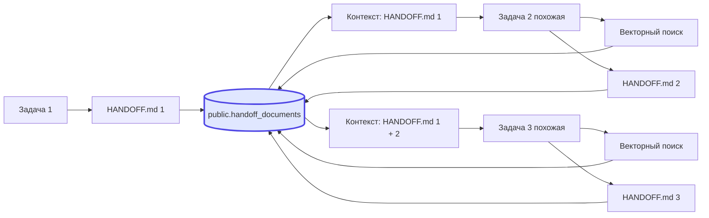

# Handoff-Driven Development (HDD)

> Содержание: новая парадигма — метод программирования с накоплением опыта. HANDOFF.md, Agent Handoff Protocol (AHP), HandoffPacket, гибрид с TDD/BDD/SDD, цикл обучения.

## 1. Что такое HDD

Handoff-Driven Development (HDD) — это **метод программирования с накоплением опыта**. Не путать с TDD (метод с обратной связью, фокус на корректности кода) или BDD (метод с обратной связью, фокус на соответствии бизнес-требованиям). HDD фокусируется на сохранении и передаче контекста, полученного в результате выполнения задачи. Его цель — избежать потери знаний, когда один агент передаёт задачу другому, или когда агент переходит от одной задачи к другой.

В традиционной разработке знания теряются. Разработчик решает сложную проблему, фиксирует результат в коде, но промежуточные выводы, отвергнутые подходы, причины выбора конкретной библиотеки — всё это остаётся в голове разработчика и исчезает, когда он переключается на другую задачу или уходит в отпуск. Следующий разработчик, столкнувшись с похожей проблемой, начинает с нуля. HDD решает эту проблему, требуя от агента (и человека) генерировать структурированный отчёт о передаче — `HANDOFF.md` — после каждой задачи. Этот отчёт сохраняется в векторную базу и становится контекстом для будущих похожих задач.

В «Студии программирования» v2.0 HDD работает в паре с Loop Engineering. Loop Engineering создаёт поток задач (автономные циклы 24/7), а HDD превращает результаты этих задач в обучающую базу для будущих циклов. Чем больше задач выполняет система, тем богаче и точнее становится её память, что повышает скорость и качество выполнения следующих задач. Это не просто ускорение разработки, а её фундаментальная трансформация: «Студия» перестаёт быть набором инструментов и становится живым организмом, способным к постоянному обучению и адаптации.

## 2. Сравнение парадигм

| Парадигма | Фокус | Механизм | Роль человека | Роль ИИ |
|-----------|-------|----------|--------------|---------|
| **TDD** | Корректность кода | Падающие unit-тесты перед кодом, рефакторинг | Написание тестов, анализ ошибок | Генерация кода, проходящего тесты |
| **BDD** | Соответствие бизнес-требованиям | Сценарии на Gherkin как исполняемые спецификации | Формулировки сценариев, критерии приёмки | Генерация кода по сценариям |
| **SDD** | Чёткая цель перед работой | Исполняемые спецификации (спеки) | Формулирование спеков, ограничения | Выполнение спеков |
| **HDD** | Сохранение и передача контекста | Структурированные отчёты HANDOFF.md | Участие в формировании отчёта | Автоматическая генерация и использование отчётов |

### 2.1. Аналитическое различие

TDD и BDD — это **методы программирования с обратной связью**. Они действуют как система контроля качества: TDD гарантирует, что код работает правильно на низком уровне, BDD гарантирует, что поведение системы соответствует бизнес-требованиям. Оба метода используют обратную связь: тесты/scenarios → код → проверка → рефакторинг.

SDD — это **метод программирования с директивой**. Человек задаёт цель через спецификацию, агент работает в рамках заранее определённых ограничений. SDD используется для создания ясных, измеримых и исполняемых спецификаций, которые служат «договором» между человеком и ИИ.

HDD — это **метод программирования с накоплением опыта**. Его главная ценность — сбор и сохранение знаний для использования в будущем. Когда агент завершает задачу, он не просто сдаёт результат, а создаёт структурированный отчёт о том, как он к нему пришёл, какие решения принял, на каких данных основывался. Этот отчёт становится частью его контекста для следующей задачи, создавая цикл обучения и совершенствования.

### 2.2. Гибридная система

В «Студии 2.0» все четыре парадигмы сосуществуют и дополняют друг друга:

```mermaid
flowchart LR
    H[Человек] -->|формулирует| SDD[SDD: спецификация]
    SDD -->|направляет| AGENT[Hermes / OpenHands]
    AGENT -->|разбивает на задачи| TASKS[Атомарные задачи]
    
    TASKS -->|для каждой| BDD[BDD: критерии приёмки<br/>в Gherkin]
    BDD --> AGENT2[Агент реализует]
    
    AGENT2 -->|после реализации| TDD[TDD: unit-тесты<br/>проверка корректности]
    TDD -->|PASS| HDD[HDD: HANDOFF.md<br/>сохранение опыта]
    TDD -->|FAIL| AGENT2
    
    HDD -->|сохраняет в| DB[(public.handoff_documents<br/>+ pgvector)]
    DB -->|контекст для| AGENT
    
    style HDD fill:#F0FDF4,stroke:#16A34A,stroke-width:2px
    style DB fill:#E0E7FF,stroke:#4F46E5
```



**Конкретный сценарий:**
1. **SDD:** Человек определяет общую цель: «Реализовать аутентификацию JWT в FastAPI-приложении». Создаёт спецификацию с требованиями (HS256, access TTL=1h, refresh TTL=7d).
2. **Atomic decomposition:** Hermes разбивает цель на атомарные задачи: (а) реализовать `jwt.py`, (б) обновить middleware, (в) написать тесты.
3. **BDD:** Для каждой задачи человек и агент совместно определяют критерии приёмки в Gherkin: `Scenario: User logs in with valid credentials → JWT token is returned`.
4. **TDD:** Агент генерирует код, затем запускает unit-тесты. Если тесты падают — рефакторит.
5. **HDD:** После завершения задачи агент генерирует `HANDOFF.md` с описанием решений, файлов, тестов, следующих шагов. Этот отчёт сохраняется в `public.handoff_documents` с векторным эмбеддингом.

## 3. Agent Handoff Protocol (AHP)

Agent Handoff Protocol (AHP) — это стандартный протокол для передачи состояния между агентами, работающими на разных фреймворках. AHP определяет единый структурированный формат `HandoffPacket`, который гарантирует безопасную передачу состояния и предотвращает распространённые ошибки: потерю цели, избыточные вызовы инструментов, рассинхронизацию контекста.

### 3.1. Структура HandoffPacket

HandoffPacket — это YAML frontmatter + Markdown тело со следующими обязательными полями:

**YAML frontmatter:**

```yaml
---
handoff_id: 550e8400-e29b-41d4-a716-446655440000  # UUID v4
task_id: 142                                      # ID задачи в studio_<tenant>.tasks
agent: hermes                                     # Имя агента-источника
target_agent: openhands                           # Имя агента-получателя (опционально)
timestamp: 2026-07-05T14:32:00Z                  # ISO 8601
status: success                                   # success | failure | partial | escalated
model: deepseek-chat                              # Модель LLM, использованная агентом
session_id: abc123-def456-...                     # UUID сессии
tenant_id: default                                # Идентификатор тенанта
tokens_used: 38200                                # Сумма input + output токенов
cost_usd: 0.234                                   # Стоимость LLM-вызовов
---
```

**Markdown тело (обязательные секции):**

```markdown
# HANDOFF — <task title>

## Original Goal
<исходная цель задачи, как она была поставлена>

## Priority
critical | high | normal | low

## Context Summary
<сжатый контекст — что было известно на старте, какие ограничения>

## Steps Taken
1. <шаг 1>
2. <шаг 2>
3. ...

## Decisions Made
- <decision 1>: <reason>
- <decision 2>: <reason>

## Working Memory
<текущее состояние: файлы изменены, тесты пройдены, оставшиеся вопросы>

## Key Findings
- <finding 1>
- <finding 2>

## Files Modified
- path/to/file.py — <что изменено>
- path/to/test.py — <что добавлено>

## Tests
- pytest: PASS (47 tests, 0 failed)
- flake8: PASS
- bandit: PASS (0 issues)

## Next Steps
- <что должен сделать следующий агент или человек>

## Embedding Hints
<ключевые слова для будущих векторных поисков: теги, термины, технологии>
```

**Дополнительные секции для status=failure:**

```markdown
## Failure Reason
<почему задача провалилась>

## Attempted Approaches
- <approach 1>: почему не сработал
- <approach 2>: почему не сработал

## Blockers
- <blocker 1>
- <blocker 2>

## Lessons Learned
- <lesson 1>
- <lesson 2>

## Recommended Next Agent
<какой агент должен подхватить задачу и почему>
```

## 4. Реализация в Hermes

Hermes имеет встроенную команду `/handoff`, которая генерирует HANDOFF.md по AHP:

```bash
# В CLI Hermes:
hermes> /handoff --reason "task complete" --status success

# Или программно через HTTP API:
curl -X POST http://hermes:8082/api/v1/handoff/generate \
  -H "Content-Type: application/json" \
  -d '{
    "task_id": 142,
    "reason": "task complete",
    "status": "success"
  }'
```

### 4.1. Конфигурация handoff в hermes-config.yaml

```yaml
handoff:
  enabled: true
  output_dir: /config/handoffs          # Локальное сохранение
  auto_compress: true                    # Сжатие через context_compressor
  format: handoff_packet                 # AHP-формат
  save_to_db: true                       # Сохранять в PostgreSQL с embedding
  auto_generate_on_task_complete: true   # Автоматически при завершении задачи
  auto_generate_on_max_retries: true     # Автоматически при исчерпании попыток
  auto_generate_on_escalation: true      # Автоматически при эскалации
```

### 4.2. Автоматическое сохранение в БД

Когда `save_to_db: true`:

```python
def save_handoff_to_db(handoff_md: str, task_id: int, agent: str, session_id: str):
    """Сохранить HANDOFF.md в PostgreSQL с векторным эмбеддингом."""
    
    # 1. Сгенерировать эмбеддинг контента
    embedding = archivist.generate_embedding(handoff_md)
    
    # 2. Распарсить YAML frontmatter
    frontmatter, body = parse_frontmatter(handoff_md)
    
    # 3. INSERT в public.handoff_documents
    postgres_mcp.call("query", {
        "sql": """
            INSERT INTO public.handoff_documents (
                document_type, title, content_markdown, embedding,
                task_id, agent_name, session_id, handoff_packet,
                source_task_description, outcome, tokens_used, cost_usd, tenant_id
            ) VALUES (
                'handoff', $1, $2, $3, $4, $5, $6, $7, $8, $9, $10, $11, $12
            )
        """,
        "params": [
            frontmatter.get("title", f"Handoff for task {task_id}"),
            handoff_md,
            embedding,
            task_id,
            agent,
            session_id,
            frontmatter,  # handoff_packet JSONB
            frontmatter.get("original_goal", ""),
            frontmatter.get("status", "success"),
            frontmatter.get("tokens_used", 0),
            frontmatter.get("cost_usd", 0),
            frontmatter.get("tenant_id", "default")
        ]
    })
```

## 5. Использование HANDOFF.md в будущих задачах

Когда Hermes получает новую задачу, он автоматически ищет похожие HANDOFF.md через векторный поиск:

```python
def get_relevant_handoffs(task_description: str, tenant_id: str, top_k: int = 3) -> list:
    """Найти релевантные HANDOFF.md для новой задачи."""
    
    # 1. Сгенерировать эмбеддинг описания новой задачи
    query_embedding = archivist.generate_embedding(task_description)
    
    # 2. k-NN поиск в public.handoff_documents
    result = postgres_mcp.call("query", {
        "sql": """
            SELECT id, title, content_markdown, outcome,
                   1 - (embedding <=> $1::vector) AS similarity
            FROM public.handoff_documents
            WHERE document_type = 'handoff'
              AND tenant_id = $2
              AND outcome IN ('success', 'partial')
            ORDER BY embedding <=> $1::vector
            LIMIT $3
        """,
        "params": [query_embedding, tenant_id, top_k]
    })
    
    return result["rows"]
```

Найденные HANDOFF.md встраиваются в системный промпт Hermes:

```python
def build_system_prompt(task_description: str, tenant_id: str) -> str:
    relevant_handoffs = get_relevant_handoffs(task_description, tenant_id)
    
    handoff_context = ""
    for h in relevant_handoffs:
        handoff_context += f"""
## Опыт из прошлой задачи (similarity: {h['similarity']:.2f})
**Задача:** {h['title']}
**Исход:** {h['outcome']}

{h['content_markdown'][:2000]}  # обрезаем до 2000 символов
---
"""
    
    return f"""
# Role: Hermes Agent

Ты — оркестратор «Студии программирования».

## Текущая задача
{task_description}

## Релевантный опыт из прошлых задач
Ниже приведены похожие задачи, которые ты или другой агент решали ранее.
Используй этот опыт, но не копируй слепо — каждая задача уникальна.

{handoff_context}

## Принципы
1. Используй опыт прошлых задач, но проверяй актуальность
2. Если прошлый handoff завершился failure, избегай тех же подходов
3. Сохраняй HANDOFF.md после завершения текущей задачи
"""
```

## 6. Пример: FastAPI JWT миграция

Конкретный пример HANDOFF.md для реальной задачи — миграция с session-based auth на JWT:

```markdown
---
handoff_id: 550e8400-e29b-41d4-a716-446655440000
task_id: 142
agent: hermes
target_agent: null
timestamp: 2026-07-05T14:32:00Z
status: success
model: deepseek-chat
session_id: abc123-def456-ghi789
tenant_id: default
tokens_used: 38200
cost_usd: 0.234
---

# HANDOFF — Migrate auth from Flask-Login to FastAPI JWT

## Original Goal
Мигрировать auth-модуль с Flask-Login на FastAPI + JWT. Старая система сессий не масштабируется при горизонтальном масштабировании.

## Priority
high

## Context Summary
Проект: myorg/myrepo, ветка main. Использует FastAPI 0.104, SQLAlchemy 2.0, PostgreSQL 16. Старая система: Flask-Login + server-side sessions в Redis. Новая система: JWT (access + refresh tokens).

## Steps Taken
1. Изучил текущий код в `app/auth/` — найден `session_manager.py` (245 строк)
2. Через postgres MCP выполнил векторный поиск в `public.skills` — найден навык "fastapi-jwt-auth" (similarity: 0.89)
3. Через postgres MCP выполнил векторный поиск в `public.handoff_documents` — найден похожий handoff от 2026-05-12 (similarity: 0.71) — миграция JWT в другом проекте
4. Через SOA MCP выполнил `so_search("FastAPI JWT best practices")` — найден вопрос с 156 голосами и accepted answer, рекомендующий python-jose
5. Реализовал `app/auth/jwt.py` (124 строки) — функции `create_access_token`, `create_refresh_token`, `verify_token`
6. Обновил `app/middleware/auth.py` (+34 строки) — замена session-проверки на JWT-проверку
7. Написал 47 unit-тестов в `tests/test_auth.py` (267 строк)

## Decisions Made
- Выбрали python-jose (не PyJWT): поддержка JWS, лучшая документация, рекомендация SOA (156 голосов)
- Выбрали HS256 (не RS256): простота, не нужен отдельный key management
- Access token TTL=1h, refresh TTL=7d: баланс безопасности и UX
- Refresh tokens хранятся в БД (таблица `refresh_tokens`): возможность отзыва

## Working Memory
3 файла изменено, 47 тестов пройдено, миграция БД создана (`migrations/versions/abc123_add_refresh_tokens.py`). Не требуется обновление фронтенда — он уже работает с Bearer token.

## Key Findings
1. Старая система хранила session_id в Redis с TTL 24h — нужно очистить Redis при деплое
2. SQLAlchemy 2.0 требует явного type annotation для mapped columns
3. python-jose требует `algorithm="HS256"` строкой, не enum

## Files Modified
- `app/auth/jwt.py` (новый, 124 строки) — JWT generation/verification
- `app/middleware/auth.py` (обновлён, +34 строки) — замена session на JWT
- `tests/test_auth.py` (новый, 267 строк) — 47 unit-тестов
- `migrations/versions/abc123_add_refresh_tokens.py` (новый) — Alembic миграция

## Tests
- pytest: PASS (47 tests, 0 failed, 2.3s)
- flake8: PASS (0 issues)
- bandit: PASS (0 issues, severity: low)
- semgrep: PASS (0 findings)
- coverage: 92% для `app/auth/jwt.py`

## Next Steps
1. Обновить документацию API в `/docs/auth.md` — добавить описание JWT flow
2. Добавить rotation refresh token в следующей итерации (issue #145)
3. Настроить очистку Redis от старых session_id при деплое
4. Интегрировать с Sentry — отслеживать JWT errors

## Embedding Hints
fastapi, jwt, auth, migration, flask-login to fastapi, python-jose, HS256, access token, refresh token, sqlalchemy 2.0, redis session cleanup, bearer token, middleware, unit tests, alembic migration
```

## 7. Цикл обучения

HDD создаёт **положительную обратную связь**: чем больше задач выполняет система, тем богаче и точнее становится её память, что повышает скорость и качество выполнения следующих задач.



**Эффект:**
- Задача 1: 0 релевантных handoff'ов в БД → решение с нуля, 100K токенов
- Задача 2 (похожая): 1 релевантный handoff → использование опыта, 60K токенов
- Задача 3 (похожая): 2 релевантных handoff'а → использование опыта, 40K токенов
- Задача N (похожая): 5+ релевантных handoff'ов → быстрое решение, 20K токенов

## 8. Связь с Loop Engineering

HDD и Loop Engineering не конкурируют, а дополняют друг друга:

| Аспект | Loop Engineering | HDD |
|--------|------------------|-----|
| Что создаёт | Поток задач 24/7 | Память из результатов задач |
| Когда работает | До задачи (триггер) | После задачи (сохранение) |
| Что хранит | loop_runs, PROGRESS.md | handoff_documents + embeddings |
| Метрика | cost_per_accepted_change | tokens_saved_per_handoff_reuse |
| Цикл | Trigger → Maker → Checker → PR | Task → Solution → HANDOFF → Future task context |

Loop Engineering создаёт задачи, HDD превращает их результаты в обучающую базу. Без Loop Engineering HDD не имеет потока задач для обучения. Без HDD Loop Engineering каждый раз начинает с нуля, не используя прошлый опыт.

## 9. Метрики HDD

```sql
-- Эффективность HDD: сколько токенов сэкономлено за счёт переиспользования handoff'ов
SELECT 
    DATE_TRUNC('week', h.created_at) AS week,
    COUNT(*) AS new_handoffs,
    SUM(h.tokens_used) AS tokens_used_in_handoffs,
    AVG(h.tokens_used) AS avg_tokens_per_task,
    -- Если avg_tokens_per_task уменьшается со временем — HDD работает
    LAG(AVG(h.tokens_used), 4) OVER (ORDER BY DATE_TRUNC('week', h.created_at)) AS avg_4_weeks_ago
FROM public.handoff_documents h
WHERE h.document_type = 'handoff'
  AND h.outcome = 'success'
GROUP BY week
ORDER BY week DESC;
```

```sql
-- Топ переиспользуемых handoff'ов
SELECT 
    h.id,
    h.title,
    h.outcome,
    h.created_at,
    COUNT(a.id) AS reuse_count,
    ROUND(AVG(1 - (h.embedding <=> a.query_embedding)), 2) AS avg_similarity
FROM public.handoff_documents h
JOIN public.api_keys_audit a ON a.tool_name = 'vector_search'
WHERE h.document_type = 'handoff'
  AND a.timestamp > h.created_at
GROUP BY h.id, h.title, h.outcome, h.created_at
HAVING COUNT(a.id) > 0
ORDER BY reuse_count DESC
LIMIT 10;
```

## 10. Что дальше

- **Loop Engineering 2.0** — [docs/12-loop-engineering.md](12-loop-engineering.md)
- **Мультитенантность** — [docs/10-multitenancy.md](10-multitenancy.md)
- **Мониторинг и метрики** — [docs/13-monitoring-metrics.md](13-monitoring-metrics.md)
