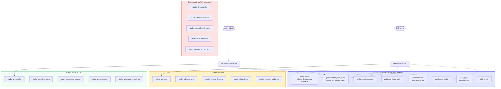

# Мультитенантность через схемы PostgreSQL

> Содержание: архитектура мультитенантности, изоляция через схемы, функция `create_tenant_schema()`, маршрутизация запросов, роли PostgreSQL, масштабирование.

## 1. Зачем мультитенантность

Одно из ключевых требований к «Студии программирования» — возможность использовать созданную систему для нескольких независимых организаций типа «Студия программирования». Это позволяет превратить «Студию» в SaaS-продукт: каждая организация (тенант) получает полную изоляцию данных, но использует общую инфраструктуру (один PostgreSQL, один Hermes, один OpenHands). Это кардинально снижает операционные расходы: вместо запуска отдельного экземпляра PostgreSQL для каждой «Студии» (что дорого и сложно в администрировании), мы используем один экземпляр, разделяя его между всеми клиентами.

Мультитенантность в «Студии 2.0» реализована через **схемы PostgreSQL**. PostgreSQL предоставляет встроенный механизм для создания изолированных пространств имён внутри одной базы данных — схемы. Мы используем этот механизм для создания изолированных сред для каждой «Студии»: вместо одной большой таблицы `tasks` для всех, мы создаём `studio_acme.tasks`, `studio_glb.tasks`, `studio_default.tasks` — каждая в своей схеме. Данные одной «Студии» никогда не смешиваются с данными другой, при этом все пользуются одним экземпляром PostgreSQL с его преимуществами (репликация, бэкапы, самовосстановление).

## 2. Архитектура



## 3. Разделение данных

### 3.1. Что в shared (public)

Некоторые данные разумно делать общими для всех тенантов:

| Таблица | Почему shared |
|---------|--------------|
| `public.skills` | Библиотека навыков — общие best practices для всех |
| `public.handoff_documents` | Векторная память — поиск похожих задач по всем тенантам (с фильтром по tenant_id) |
| `public.tenants` | Реестр самих тенантов |
| `public.soa_cache` | Кэш SOA-ответов — общий для экономии лимита |
| `public.api_keys_audit` | Аудит всех MCP-вызовов (с полем tenant_id для фильтрации) |
| `code_graph`, `task_graph` | Графы AGE — узлы имеют свойство `tenant_id` |

### 3.2. Что в tenant-схемах

Данные, специфичные для каждой организации:

| Таблица | Что хранит |
|---------|-----------|
| `studio_<t>.tasks` | Задачи конкретного тенанта |
| `studio_<t>.loop_runs` | История прогонов loop |
| `studio_<t>.loop_lessons` | Извлечённые уроки |
| `studio_<t>.loop_progress` | PROGRESS.md для каждого loop |
| `studio_<t>.loop_registry` | Реестр loop тенанта |
| `studio_<t>.projects` | Проекты тенанта |
| `studio_<t>.agent_audit_log` | Аудит действий агентов (партиционированный) |

## 4. Создание нового тенанта

### 4.1. Функция `create_tenant_schema()`

```sql
-- Пример вызова
SELECT public.create_tenant_schema('acme');
-- Создаёт схему studio_acme со всеми таблицами
-- Вставляет запись в public.tenants
-- Возвращает TRUE при успехе
```

Функция выполняет:
1. `CREATE SCHEMA IF NOT EXISTS studio_<tenant_id>`
2. `GRANT USAGE ON SCHEMA studio_<tenant_id> TO studio_writer`
3. `GRANT SELECT, INSERT, UPDATE, DELETE ON ALL TABLES IN SCHEMA studio_<tenant_id> TO studio_writer`
4. Создаёт все 7 таблиц (tasks, loop_runs, loop_lessons, loop_progress, loop_registry, projects, agent_audit_log)
5. Создаёт партиции для `agent_audit_log` (12 месяцев вперёд)
6. Создаёт индексы
7. Вставляет запись в `public.tenants`

### 4.2. Скрипт создания тенанта

```bash
#!/usr/bin/env bash
# scripts/create-tenant.sh
set -euo pipefail

TENANT_ID=$1
TENANT_NAME=$2

if [ -z "$TENANT_ID" ] || [ -z "$TENANT_NAME" ]; then
    echo "Usage: $0 <tenant_id> <tenant_name>"
    echo "Example: $0 acme 'Acme Corporation'"
    exit 1
fi

echo "Creating tenant: $TENANT_ID ($TENANT_NAME)..."

docker exec -i nocodb-postgres-db psql -U nocodb_user -d hermes_brain << EOF
SELECT public.create_tenant_schema('$TENANT_ID');

UPDATE public.tenants 
SET name = '$TENANT_NAME', 
    description = 'Created via script at $(date -u +%Y-%m-%dT%H:%M:%SZ)'
WHERE tenant_id = '$TENANT_ID';

SELECT tenant_id, schema_name, name, created_at 
FROM public.tenants 
WHERE tenant_id = '$TENANT_ID';
EOF

echo ""
echo "[OK] Tenant '$TENANT_ID' created successfully"
echo "     Schema: studio_$TENANT_ID"
echo "     Tables: tasks, loop_runs, loop_lessons, loop_progress, loop_registry, projects, agent_audit_log"
echo ""
echo "Next steps:"
echo "  1. Configure Hermes with tenant_id='$TENANT_ID'"
echo "  2. Configure NocoDB to display studio_$TENANT_ID tables"
echo "  3. Set up egress proxy rules if needed"
```

### 4.3. Удаление тенанта

```sql
-- Осторожно: удаляет все данные тенанта
SELECT public.drop_tenant_schema('acme');
-- DETACH и DROP всех партиций agent_audit_log
-- DROP SCHEMA studio_acme CASCADE
-- DELETE FROM public.tenants WHERE tenant_id = 'acme'
```

## 5. Маршрутизация запросов

Когда пользователь от имени «Студии A» отправляет запрос, Holix Backend (или Hermes) должен модифицировать запрос, указывая, что он должен выполняться в схеме `studio_acme`. Это достигается через:
1. Установку `search_path` в начале сессии
2. Явное указание схемы в SQL-запросах
3. Передачу `tenant_id` как параметра во все MCP-вызовы

### 5.1. Установка search_path

```sql
-- В начале сессии Hermes устанавливает search_path
SET search_path TO studio_acme, public, ag_catalog;
-- Теперь SELECT * FROM tasks автоматически разрешается в studio_acme.tasks
-- Но public.skills и public.handoff_documents тоже доступны
```

### 5.2. Явное указание схемы

Для надёжности лучше всегда указывать схему явно:

```sql
-- Плохо — зависит от search_path
SELECT * FROM tasks WHERE status = 'open';

-- Хорошо — явно указана схема
SELECT * FROM studio_acme.tasks WHERE status = 'open';

-- Для shared таблиц — public
SELECT * FROM public.skills WHERE tenant_id = 'acme' OR tenant_id = 'default';
```

### 5.3. Передача tenant_id в MCP-вызовах

Hermes передаёт `tenant_id` во всех вызовах postgres MCP:

```python
# Hermes получает tenant_id из контекста сессии
def get_tasks_for_tenant(tenant_id: str, status: str = 'open'):
    schema = f"studio_{tenant_id}"
    
    result = postgres_mcp.call("query", {
        "sql": f"""
            SELECT id, title, status, priority, assignee_agent
            FROM {schema}.tasks
            WHERE status = $1
            ORDER BY priority DESC, created_at ASC
            LIMIT 50
        """,
        "params": [status]
    })
    return result["rows"]
```

## 6. Роли PostgreSQL

Для строгой изоляции можно создать отдельных пользователей PostgreSQL для каждой «Студии»:

```sql
-- Создать роль для тенанта acme
CREATE ROLE tenant_acme LOGIN PASSWORD 'secure_random_password';
GRANT USAGE ON SCHEMA studio_acme TO tenant_acme;
GRANT SELECT, INSERT, UPDATE, DELETE ON ALL TABLES IN SCHEMA studio_acme TO tenant_acme;
GRANT SELECT ON public.skills TO tenant_acme;
GRANT SELECT ON public.handoff_documents TO tenant_acme WHERE tenant_id = 'acme';
GRANT SELECT ON public.tenants TO tenant_acme WHERE tenant_id = 'acme';

-- Создать роль для тенанта glb
CREATE ROLE tenant_glb LOGIN PASSWORD 'another_secure_password';
GRANT USAGE ON SCHEMA studio_glb TO tenant_glb;
GRANT SELECT, INSERT, UPDATE, DELETE ON ALL TABLES IN SCHEMA studio_glb TO tenant_glb;
GRANT SELECT ON public.skills TO tenant_glb;
GRANT SELECT ON public.handoff_documents TO tenant_glb WHERE tenant_id = 'glb';
GRANT SELECT ON public.tenants TO tenant_glb WHERE tenant_id = 'glb';
```

Теперь, даже если злоумышленник получит доступ к `tenant_acme`, он не сможет читать данные `studio_glb` — PostgreSQL отклонит запрос с `permission denied for table studio_glb.tasks`.

## 7. NocoDB и мультитенантность

NocoDB может отображать таблицы из нескольких схем одновременно. Для каждой «Студии» можно создать отдельный NocoDB-проект:

```yaml
# docker-compose.yml — можно запустить несколько NocoDB-инстансов
nocodb-acme:
  image: nocodb/nocodb:latest
  environment:
    NC_DB: "pg://postgres-db:5432/hermes_brain"
    NC_DB_USER: tenant_acme  # ограниченная роль
    NC_DB_PASSWORD: ${TENANT_ACME_PASSWORD}
    NC_AUTH_JWT_SECRET: ${NC_AUTH_JWT_SECRET}
  ports:
    - "8081:8080"  # UI для Acme на порту 8081

nocodb-glb:
  image: nocodb/nocodb:latest
  environment:
    NC_DB: "pg://postgres-db:5432/hermes_brain"
    NC_DB_USER: tenant_glb  # ограниченная роль
    NC_DB_PASSWORD: ${TENANT_GLB_PASSWORD}
    NC_AUTH_JWT_SECRET: ${NC_AUTH_JWT_SECRET}
  ports:
    - "8082:8080"  # UI для GLB на порту 8082
```

Каждая организация видит только свои таблицы — изоляция на уровне БД.

## 8. Графы AGE и мультитенантность

Apache AGE хранит графы в одной схеме `ag_catalog`, но узлы имеют свойство `tenant_id`:

```cypher
-- Добавить узел с tenant_id
SELECT * FROM ag_catalog.cypher('code_graph', $$
    CREATE (:Microservice {
        name: 'api-gateway',
        version: '1.4.0',
        tenant_id: 'acme'
    })
$$) AS (result agtype);

-- Найти узлы только для конкретного тенанта
SELECT * FROM ag_catalog.cypher('code_graph', $$
    MATCH (s:Microservice {tenant_id: 'acme'})
    RETURN s.name, s.version
$$) AS (name agtype, version agtype);
```

Альтернативный подход — создать отдельный граф для каждого тенанта: `code_graph_acme`, `code_graph_glb`. Это даёт более строгую изоляцию, но усложняет cross-tenant аналитику.

## 9. Масштабирование

### 9.1. Вертикальное масштабирование

На начальном этапе одна мощная БД PostgreSQL с мультитенантностью — самое простое и эффективное решение. Рекомендуемая конфигурация для 10-20 тенантов:
- 64 ГБ RAM (HNSW-индексы для каждого тенанта)
- 16 CPU
- 2 ТБ NVMe SSD

### 9.2. Горизонтальное масштабирование (sharding)

Если нагрузка на одну БД станет слишком большой, можно использовать шардирование:
- Разделить тенантов по нескольким инстансам PostgreSQL (round-robin или по домену)
- Использовать pg_partman для партиционирования `agent_audit_log` по tenant_id
- Cross-shard запросы выполнять через postgres_fdw (foreign data wrapper)

### 9.3. Масштабирование векторного поиска

pgvector хорошо масштабируется:
- HNSW-индекс для каждого тенанта — отдельный индекс в `public.handoff_documents`
- При росте > 1M векторов на тенант — рассмотреть переход на IVFFlat
- Можно использовать pgvector 0.7+ с поддержкой half-precision (2x экономия памяти)

## 10. Преимущества мультитенантной архитектуры

| Преимущество | Обоснование |
|-------------|-------------|
| Экономия ресурсов | Один PostgreSQL для всех вместо десятков |
| Простота администрирования | Один бэкап, одна репликация, один мониторинг |
| Гибкость | Лёгкое добавление/удаление тенантов |
| Надёжность | Все преимущества PostgreSQL (ACID, репликация) применяются ко всем |
| Изоляция | Схемы PostgreSQL гарантируют разделение данных |
| Безопасность | Отдельные роли с правами только на свою схему |

## 11. Что дальше

- **Модель безопасности** — [docs/11-security-model.md](11-security-model.md)
- **Loop Engineering 2.0** — [docs/12-loop-engineering.md](12-loop-engineering.md)
- **Мониторинг и метрики** — [docs/13-monitoring-metrics.md](13-monitoring-metrics.md)
