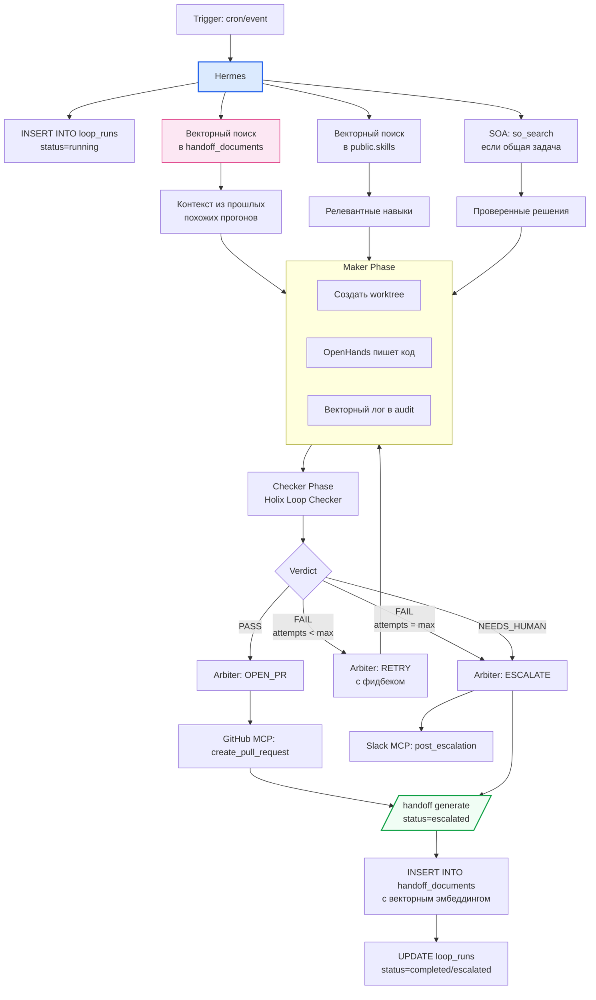

# Loop Engineering 2.0

> Содержание: обновлённая методология Loop Engineering с конвергентной БД. 5 базовых блоков, 8 фаз, тест 4 условий, защита от 10 ошибок, интеграция с HDD.

## 1. Что нового в Loop Engineering 2.0

Loop Engineering 2.0 — это эволюция методологии v1.0 с учётом нового «мозга» системы (PostgreSQL + pgvector + Apache AGE вместо NocoDB) и новой парадигмы Handoff-Driven Development. Базовая концепция осталась прежней: проектирование автономных систем, которые работают по расписанию или событиям, сами находят задачи, выполняют их через maker-checker pipeline и сохраняют состояние между прогонами. Но реализация изменилась кардинально.

**Главные отличия 2.0 от 1.0:**

1. **Состояние loop хранится в конвергентной БД**, а не в NocoDB. Таблица `studio_<tenant>.loop_runs` заменила старую `loop_runs` в NocoDB. Это устранило проблемы с MCP-соединением (`Session terminated`, `404 Not Found`) и дало векторный поиск по истории прогонов.

2. **PROGRESS.md обогащается через векторный поиск.** При каждом прогоне loop Hermes перед началом работы выполняет векторный поиск в `public.handoff_documents` — находит похожие прошлые прогоны и использует их опыт. Это превратило loop из «слепого конвейера» в «обучающуюся систему».

3. **SOA как первый уровень фильтрации.** Для общих программистских задач loop сначала обращается к SOA (Stack Overflow for Agents), и только если ответ не найден — переходит к OpenHands. Это экономит токены и снижает риск «галлюцинаций».

4. **HANDOFF.md после каждого прогона.** Loop Engineering 2.0 интегрирован с HDD: после каждого прогона (успешного или провального) Hermes генерирует HANDOFF.md и сохраняет его в `public.handoff_documents` с векторным эмбеддингом. Это создаёт цикл обучения между loop-прогонами.

5. **Графовый анализ зависимостей через Apache AGE.** Loop Engineering 2.0 может использовать графовый слой для анализа влияния изменений: перед refactor-loop Hermes запрашивает `find_impact_circle(file_path)` и понимает, какие модули будут затронуты.

## 2. Пять базовых блоков (обновлённые)

### 2.1. Automation (Heartbeat) — пульс системы

Триггеры: cron, event (webhook), condition (периодическая проверка). Реестр триггеров в `~/.hermes/crons/loop_scheduler.yaml`:

```yaml
triggers:
  - name: dependency-update
    type: cron
    schedule: "0 10 * * 1"
  
  - name: morning-triage
    type: cron
    schedule: "0 9 * * 1-5"
  
  - name: lint-and-fix
    type: webhook
    source: github
    event: pull_request.opened
  
  - name: flaky-test-fix
    type: webhook
    source: github_actions
    event: workflow_run.completed
    condition: "conclusion == 'failure' AND retry_passed == true"
  
  - name: pr-drafting
    type: webhook
    source: github
    event: issues.labeled
    condition: "label.name == 'ready-for-dev'"
```

### 2.2. Worktree (изоляция) — параллельность без хаоса

Git worktree для каждого прогона — отдельная рабочая директория на своей ветке. После завершения loop worktree удаляется.

```bash
git worktree add ../worktrees/loop-{loop_name}-{run_id} -b loop/{loop_name}/{run_id}
# ... работа в worktree ...
git worktree remove ../worktrees/loop-{loop_name}-{run_id}
```

### 2.3. Skills (знания) — контекст проекта, записанный раз

SKILL.md файлы с YAML-метаданными. В 2.0 хранятся в `public.skills` с векторным эмбеддингом для семантического поиска. Hermes находит релевантные навыки через k-NN перед началом loop.

### 2.4. Connectors (MCP) — loop действует, а не только советует

5 MCP-серверов: postgres (мозг), SOA (внешние знания), GitHub (PR, issues), Slack (уведомления), Sentry (алерты). Все подключаются через стандартный MCP-протокол.

### 2.5. Sub-agents (maker-checker) — исполнитель отдельно от проверяющего

- **OpenHands** — Maker (трудоёмкие задачи)
- **Holix Loop Checker** — Checker (объективный PASS/FAIL)
- **Hermes** — Arbiter (финальное решение)

## 3. Spine — файл состояния 2.0

### 3.1. Таблица `studio_<tenant>.loop_runs`

```sql
CREATE TABLE studio_<tenant>.loop_runs (
    id BIGSERIAL PRIMARY KEY,
    loop_name VARCHAR(100) NOT NULL,
    run_started TIMESTAMP DEFAULT NOW(),
    run_finished TIMESTAMP,
    status VARCHAR(20) DEFAULT 'running',
    trigger_type VARCHAR(20),
    trigger_details JSONB,
    worktree_path TEXT,
    attempts INTEGER DEFAULT 0,
    tokens_used INTEGER DEFAULT 0,
    cost_usd DECIMAL(10,4) DEFAULT 0,
    pr_url TEXT,
    maker_output JSONB,
    checker_verdict JSONB,
    outcome JSONB,
    lessons_learned TEXT,
    handoff_document_id BIGINT,  -- НОВОЕ: ссылка на HANDOFF.md
    error_message TEXT
);
```

**Новое поле `handoff_document_id`** — связывает прогон loop с сгенерированным HANDOFF.md в `public.handoff_documents`. Это позволяет при следующем похожем прогоне найти этот handoff через векторный поиск.

### 3.2. `studio_<tenant>.loop_progress`

```sql
CREATE TABLE studio_<tenant>.loop_progress (
    id SERIAL PRIMARY KEY,
    loop_name VARCHAR(100) UNIQUE NOT NULL,
    last_run TIMESTAMP,
    last_status VARCHAR(20),
    in_progress JSONB,
    completed_today JSONB,
    escalated_to_humans JSONB,
    progress_markdown TEXT,
    updated_at TIMESTAMP DEFAULT NOW()
);
```

Содержимое PROGRESS.md:

```markdown
# Dependency Update Loop — Progress

## Last run
2026-07-05 10:00 UTC · 4 packages updated, 0 failures, PR #47 merged

## In progress
- (пусто)

## Completed
- 2026-07-05: `requests` 2.31.0 → 2.32.0 (PR #47 merged)
- 2026-07-05: `black` 24.1.0 → 24.4.2 (PR #47 merged)

## Escalated to humans
- `django` 4.2 → 5.0 (major update, requires manual review)

## Lessons learned
- 2026-07-05: `pytest-cov` требует точной версии pytest. Обновлять вместе.
- 2026-06-28: `numpy` 2.0 сломал 40% тестов. Добавили в исключения.
```

## 4. Алгоритм loop-прогона 2.0



### 4.1. Псевдокод runner.py 2.0

```python
def run_loop(loop_name: str, trigger_context: dict = None):
    """Запуск одного loop-прогона в архитектуре 2.0."""
    loop = LOOPS[loop_name]
    tenant_id = get_current_tenant()
    schema = f"studio_{tenant_id}"
    
    # 1. Создать запись в loop_runs
    run_id = postgres_mcp.call("query", {
        "sql": f"INSERT INTO {schema}.loop_runs (loop_name, status, trigger_type, trigger_details) VALUES ($1, 'running', $2, $3) RETURNING id",
        "params": [loop_name, trigger_context.get("type"), trigger_context]
    })["rows"][0]["id"]
    
    # 2. Векторный поиск в handoff_documents — найти похожие прошлые прогоны
    progress_query_embedding = archivist.generate_embedding(
        f"{loop_name} {trigger_context.get('description', '')}"
    )
    similar_handoffs = postgres_mcp.call("query", {
        "sql": """
            SELECT title, content_markdown, outcome, 
                   1 - (embedding <=> $1::vector) AS similarity
            FROM public.handoff_documents
            WHERE document_type = 'handoff'
              AND tenant_id = $2
              AND outcome IN ('success', 'partial')
              AND title ILIKE '%' || $3 || '%'
            ORDER BY embedding <=> $1::vector
            LIMIT 3
        """,
        "params": [progress_query_embedding, tenant_id, loop_name]
    })["rows"]
    
    # 3. Векторный поиск в skills — найти релевантные навыки
    relevant_skills = postgres_mcp.call("vector_search", {
        "table": "public.skills",
        "query_vector": archivist.generate_embedding(loop["description"]),
        "filter": f"status = 'approved' AND tenant_id = '{tenant_id}'",
        "top_k": 5
    })["results"]
    
    # 4. SOA — если задача может иметь общее решение
    soa_findings = []
    if loop.get("is_general_programming_task"):
        soa_findings = soa_mcp.call("so_search", {
            "query": loop["description"],
            "limit": 3,
            "sort": "relevance"
        })["results"]
    
    # 5. Maker-checker цикл
    attempts = 0
    total_tokens = 0
    
    while attempts < loop["max_retries"]:
        attempts += 1
        tokens_before = get_token_usage()
        
        # Maker phase
        worktree = create_git_worktree(loop_name, run_id)
        maker_output = invoke_maker(
            agent=loop["maker"],
            skill_path=loop["skill_path"],
            worktree=worktree,
            context={
                "similar_handoffs": similar_handoffs,
                "relevant_skills": relevant_skills,
                "soa_findings": soa_findings,
                "progress": read_progress_md(loop_name)
            }
        )
        
        # Checker phase
        checker_verdict = invoke_checker(
            agent=loop["checker"],
            worktree=worktree
        )
        
        total_tokens += get_token_usage() - tokens_before
        
        # Arbiter phase
        decision = arbiter_decide(checker_verdict, attempts, loop["max_retries"], total_tokens, loop["token_budget"])
        
        if decision == "OPEN_PR":
            pr_url = open_pull_request(worktree, loop_name, run_id)
            
            # НОВОЕ: сгенерировать HANDOFF.md
            handoff_md = hermes.handoff_generate(
                task_id=run_id,
                status="success",
                context={
                    "loop_name": loop_name,
                    "maker_output": maker_output,
                    "checker_verdict": checker_verdict,
                    "similar_handoffs": similar_handoffs,
                    "soa_findings": soa_findings
                }
            )
            
            # НОВОЕ: сохранить HANDOFF.md в handoff_documents с embedding
            handoff_id = save_handoff_to_db(handoff_md, run_id, "hermes", tenant_id)
            
            # Обновить loop_runs
            postgres_mcp.call("query", {
                "sql": f"UPDATE {schema}.loop_runs SET status='completed', run_finished=NOW(), pr_url=$1, tokens_used=$2, cost_usd=$3, handoff_document_id=$4 WHERE id=$5",
                "params": [pr_url, total_tokens, calculate_cost(total_tokens), handoff_id, run_id]
            })
            
            update_progress_md(loop_name, maker_output, "merged")
            notify_slack_loop_completed(loop_name, run_id, pr_url, total_tokens)
            return run_id
        
        if decision == "RETRY":
            update_progress_md(loop_name, maker_output, f"retry #{attempts}")
            continue
        
        if decision == "ESCALATE":
            # Сгенерировать HANDOFF.md со status=escalated
            handoff_md = hermes.handoff_generate(
                task_id=run_id, status="escalated",
                context={"checker_verdict": checker_verdict, "attempts": attempts}
            )
            handoff_id = save_handoff_to_db(handoff_md, run_id, "hermes", tenant_id)
            
            postgres_mcp.call("query", {
                "sql": f"UPDATE {schema}.loop_runs SET status='escalated', run_finished=NOW(), tokens_used=$1, cost_usd=$2, handoff_document_id=$3, error_message=$4 WHERE id=$5",
                "params": [total_tokens, calculate_cost(total_tokens), handoff_id, str(checker_verdict), run_id]
            })
            
            notify_slack_escalation(loop_name, run_id, checker_verdict)
            return run_id
    
    # Все попытки исчерпаны
    postgres_mcp.call("query", {
        "sql": f"UPDATE {schema}.loop_runs SET status='failed', run_finished=NOW(), tokens_used=$1 WHERE id=$2",
        "params": [total_tokens, run_id]
    })
    return run_id
```

## 5. Тест 4 условий

Перед созданием нового loop проверьте все 4 условия:

| Условие | Вопрос |
|---------|--------|
| **Повторяемость** | Выполняется ли задача ≥1 раза в неделю? |
| **Автоматический шлюз** | Может ли тест/линтер отвергнуть плохой результат? |
| **Агентский запуск** | Может ли агент запустить код и проверить его? |
| **Критерий остановки** | Есть ли жёсткий критерий «готово»? |

**Задачи, которые НЕ подходят для loop:**
- Архитектурные решения
- Авторизация и безопасность
- Платежи
- Размытые продуктовые решения

## 6. Восемь фаз внедрения (обновлённые)

### Фаза 0: Диагностика (Неделя 1)
- Проверка, что PostgreSQL + pgvector + AGE установлены
- Установка MCP-серверов (postgres, SOA)
- Тест 4 условий для 10 кандидатов в loop
- Выбор первого loop (Dependency Update)

### Фаза 1: MVP loop (Неделя 2)
- Создание SKILL.md для dependency-update
- Выполнение SQL-схемы (`examples/sql/03-tenant-schema-template.sql`)
- Ручной запуск MVP
- Критерии успеха: loop выполнен вручную, PR открыт, <50K токенов

### Фаза 2: Spine + Skills + память (Неделя 3)
- Создание PROGRESS.md
- Настройка Архивариуса для Lesson Extraction
- **НОВОЕ**: Векторный поиск в `public.handoff_documents` перед каждым прогоном
- Критерии: PROGRESS.md обновляется, уроки извлекаются, следующий прогон читает PROGRESS.md

### Фаза 3: Maker-Checker split (Неделя 4)
- Создание профиля `holix-loop-checker`
- Обновление Hermes: режим Arbiter
- Критерии: Maker и Checker в разных контейнерах, после 3 неудач — эскалация

### Фаза 4: 4 продвинутых loop-паттерна (Неделя 5-6)
- morning-triage, flaky-test-fix, lint-and-fix, pr-drafting
- **НОВОЕ**: morning-triage использует SOA для поиска решений ошибок
- Критерии: ≥4 loop разных типов работают

### Фаза 5: Loop Engine в Hermes (Неделя 7)
- Модуль `loop_engine` (registry, scheduler, runner, state_manager, cost_tracker)
- **НОВОЕ**: Runner интегрирован с `/handoff` командой
- Критерии: реестр ≥5 loop, scheduler обрабатывает 3 типа триггеров

### Фаза 6: Налог на безопасность (Неделя 8)
- SAST/SCA в Checker (Semgrep, Bandit, pip-audit, TruffleHog)
- **НОВОЕ**: First-invoke approval для всех MCP-серверов
- **НОВОЕ**: postgres MCP security (forbid_ddl, forbid_truncate)
- Аудит прав каждые 30 дней
- Критерии: каждый PR проверяется SAST/SCA, нет credentials в логах

### Фаза 7: Мониторинг и метрики (Неделя 9)
- VIEW `loop_metrics` и `loop_health`
- Kanban-дашборд в NocoDB
- **НОВОЕ**: метрика `tokens_saved_per_handoff_reuse` — сколько токенов сэкономлено за счёт переиспользования HANDOFF.md
- Правила автоостановки unhealthy loop
- Критерии: дашборд в реальном времени, еженедельный отчёт в Slack

### Фаза 8: Защита от 10 ошибок (Неделя 10)
- `validate_new_loop()` — валидация перед регистрацией
- Ежемесячный cron: Hermes предлагает человеку ревью N случайных PR
- Критерии: ни один новый loop не запускается без валидации

## 7. Метрика, которая имеет значение

**`cost_per_accepted_change`** — единственная метрика, которая имеет значение. Не потраченные токены, не количество попыток. Если доля принятых изменений ниже 50%, loop выполняет ровно ту работу по ревью, от которой должен был избавить — система автоматически приостанавливает его.

```sql
CREATE VIEW public.loop_metrics AS
SELECT 
    tenant_id,
    loop_name,
    DATE_TRUNC('week', run_started) AS week,
    COUNT(*) AS total_runs,
    COUNT(*) FILTER (WHERE status = 'completed') AS successful_runs,
    SUM(tokens_used) AS total_tokens,
    SUM(cost_usd) AS total_cost,
    COUNT(*) FILTER (WHERE pr_url IS NOT NULL) AS prs_opened,
    ROUND(SUM(cost_usd) / NULLIF(COUNT(*) FILTER (WHERE pr_url IS NOT NULL), 0), 4) 
        AS cost_per_accepted_change
FROM studio_<tenant>.loop_runs
-- UNION ALL для всех тенантов
GROUP BY tenant_id, loop_name, DATE_TRUNC('week', run_started);
```

## 8. Защита от 10 типичных ошибок

| # | Ошибка | Защита в 2.0 |
|---|--------|--------------|
| 1 | Запуск loop без теста 4 условий | `validate_new_loop()` проверяет 4 условия |
| 2 | Отсутствие объективного шлюза | Запрет `checker == "llm-opinion"` |
| 3 | Один агент пишет и проверяет | Запрет `maker == checker` |
| 4 | Отсутствие файла состояния | Требование `PROGRESS.md` |
| 5 | Размытые условия остановки | Запрет `stop_condition == "looks-good"` |
| 6 | Отсутствие лимита токенов | Требование `token_budget` в SKILL.md |
| 7 | Дорогой тариф без обоснования | `cost_justified()` проверка |
| 8 | Community skills без аудита | `install_skill()` с проверкой источника |
| 9 | Задачи, требующие суждения | `requires_judgment()` проверка |
| 10 | Игнорирование диффов | Требование `has_human_review_step` |

## 9. Интеграция с HDD

Loop Engineering 2.0 интегрирован с Handoff-Driven Development:

| Этап loop | Что делает HDD |
|-----------|----------------|
| Перед прогоном | Векторный поиск в `public.handoff_documents` — найти похожие прошлые прогоны |
| Во время работы | Использовать опыт прошлых прогонов как контекст |
| После PASS | Сгенерировать HANDOFF.md (status=success) и сохранить в БД с embedding |
| После FAIL | Сгенерировать HANDOFF.md (status=failure) с описанием ошибки и lessons learned |
| После ESCALATE | Сгенерировать HANDOFF.md (status=escalated) с recommended next agent |

Подробно о HDD — в [docs/09-handoff-driven-development.md](09-handoff-driven-development.md).

## 10. Что дальше

- **Мониторинг и метрики** — [docs/13-monitoring-metrics.md](13-monitoring-metrics.md)
- **Troubleshooting** — [docs/14-troubleshooting.md](14-troubleshooting.md)
- **Дорожная карта** — [docs/15-roadmap.md](15-roadmap.md)
