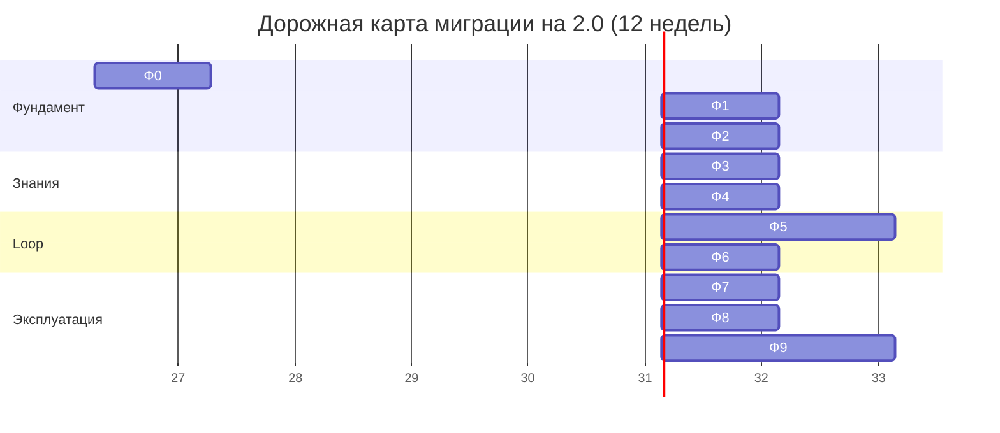

# Дорожная карта — 12 недель миграции на 2.0

> Содержание: план миграции с v1.0 на v2.0 (разделение ответственности, конвергентная БД, SOA, HDD). Что делать в день 1, неделю 1, месяц 1. Долгосрочная стратегия.

## 1. Обзор

Миграция с «Студии программирования» v1.0 на v2.0 — это **12-недельный процесс**, разбитый на 9 фаз. Каждая фаза имеет чёткие цели, артефакты и критерии успеха. Фазы идут последовательно — нельзя перейти к Фазе 3 (Maker-Checker split), не завершив Фазу 2 (конвергентная БД + postgres MCP). Это предотвращает накопление технического долга.

Философия миграции: **сначала надёжный ручной прогон, потом автоматизация**. Каждая фаза начинается с ручного выполнения задач, затем оборачивается в loop, и только после стабильной работы ставится на расписание. Это противоположность подходу «сразу автоматизировать всё» — последний путь приводит к тому, что loop сжигает токены на непонятных ошибках.



## 2. Фаза 0: Аудит v1.0 (Неделя 1)

**Цель:** Понять текущее состояние системы v1.0 и спланировать миграцию.

### Шаги

1. **Инвентаризация v1.0:**
   - Список всех таблиц в `studio_db` (старая БД)
   - Объём данных (количество навыков, задач, loop_runs)
   - Список MCP-подключений Hermes (`hermes mcp list`)
   - Список активных loop (`hermes loop list`)
   - Объём логов и аудита

2. **Backup v1.0:**
   ```bash
   docker exec nocodb-postgres-db pg_dumpall -U nocodb_user | gzip > \
     ~/syncthing-host/backup/studio-v1-full-$(date +%Y-%m-%d).sql.gz
   ```

3. **Анализ проблем v1.0:**
   - Сколько раз приходилось сбрасывать пароль NocoDB?
   - Сколько `Session terminated` ошибок в логах?
   - Какой процент loop_runs завершился `failed` или `escalated`?
   - Какая средняя стоимость `cost_per_accepted_change`?

### Артефакты

- `~/syncthing-host/migration/audit-v1.md` — отчёт о текущем состоянии
- `~/syncthing-host/backup/studio-v1-full-YYYY-MM-DD.sql.gz` — полный backup
- `~/syncthing-host/migration/migration-plan.md` — план миграции

### Критерии успеха

- ✅ Полный backup v1.0 создан
- ✅ Отчёт об аудите завершён
- ✅ План миграции утверждён

## 3. Фаза 1: Конвергентная БД (Неделя 2)

**Цель:** Развернуть PostgreSQL 16 + pgvector + Apache AGE как новый «мозг».

### Шаги

1. **Создание БД `hermes_brain`:**
   ```bash
   docker exec -it nocodb-postgres-db psql -U nocodb_user -d postgres -c "CREATE DATABASE hermes_brain;"
   ```

2. **Установка расширений:**
   ```bash
   ./scripts/06-init-convergent-db.sh
   ```

3. **Выполнение SQL-схемы:**
   ```bash
   for sql in examples/sql/*.sql; do
     docker exec -i nocodb-postgres-db psql -U nocodb_user -d hermes_brain < "$sql"
   done
   ```

4. **Создание тестового тенанта:**
   ```bash
   docker exec -it nocodb-postgres-db psql -U nocodb_user -d hermes_brain -c \
     "SELECT public.create_tenant_schema('default');"
   ```

5. **Заполнение графа code_graph** (если есть существующий код):
   ```bash
   # Запустить синхронизацию графа с репозиторием
   python3 scripts/sync-code-graph.py ~/studio/projects/main-repo
   ```

### Критерии успеха

- ✅ `hermes_brain` БД создана с расширениями vector, age, pg_trgm, pgcrypto
- ✅ Графы `code_graph` и `task_graph` созданы
- ✅ Все таблицы `public.*` и `studio_default.*` созданы
- ✅ `SELECT * FROM public.tenants` показывает тестовый тенант

## 4. Фаза 2: postgres MCP (Неделя 3)

**Цель:** Подключить Hermes к мозгу через официальный `@modelcontextprotocol/server-postgres`.

### Шаги

1. **Удаление старого NocoDB MCP-подключения:**
   ```bash
   hermes mcp remove nocodb-mcp  # если было
   ```

2. **Подключение postgres MCP:**
   ```bash
   ./scripts/07-bootstrap-hermes-mcp.sh
   ```

3. **Тест подключения:**
   ```bash
   hermes mcp test hermes-brain
   # Должно показать: OK, query, list_tables, describe_table, vector_search, graph_query
   ```

4. **Тест векторного поиска:**
   ```bash
   hermes mcp call hermes-brain vector_search '{
     "table": "public.skills",
     "query_vector": [0.1, 0.2, ...],
     "top_k": 5
   }'
   ```

5. **Тест Cypher:**
   ```bash
   hermes mcp call hermes-brain graph_query '{
     "graph": "code_graph",
     "cypher": "MATCH (n) RETURN count(n)"
   }'
   ```

### Критерии успеха

- ✅ `hermes mcp list` показывает `hermes-brain` как активное подключение
- ✅ `hermes mcp test hermes-brain` возвращает OK
- ✅ Векторный поиск работает (возвращает результаты)
- ✅ Cypher-запросы работают
- ✅ First-invoke approval срабатывает при первом вызове

## 5. Фаза 3: SOA подключение (Неделя 4)

**Цель:** Подключить Stack Overflow for Agents как внешний источник знаний.

### Шаги

1. **Регистрация приложения на Stack Apps:**
   - Перейдите на https://stackapps.com/apps/oauth/register
   - Зарегистрируйте приложение: `Studio Programming`
   - Redirect URI: `http://localhost:8082/oauth/callback`
   - Scopes: `read_inbox`, `no_expiry`
   - Скопируйте `Client ID` и `Client Secret` в `.env`

2. **Подключение SOA MCP к Hermes:**
   ```bash
   hermes mcp add stackoverflow --transport http --url https://mcp.stackoverflow.com
   ```

3. **OAuth авторизация:**
   ```bash
   hermes mcp auth stackoverflow
   # Откроется браузер — войдите в аккаунт Stack Overflow
   # Подтвердите доступ для приложения "Studio Programming"
   ```

4. **Тест SOA:**
   ```bash
   hermes mcp test stackoverflow
   # Должно показать: OK, so_search, get_content, search_by_error, analyze_stack_trace
   ```

5. **Первый запрос:**
   ```bash
   hermes mcp call stackoverflow so_search '{"query": "how to configure SSL in FastAPI"}'
   ```

### Критерии успеха

- ✅ OAuth авторизация пройдена
- ✅ `hermes mcp test stackoverflow` возвращает OK
- ✅ `so_search` возвращает результаты
- ✅ Кэш `public.soa_cache` создаётся автоматически

## 6. Фаза 4: HDD настройка (Неделя 5)

**Цель:** Включить Handoff-Driven Development — генерацию и сохранение HANDOFF.md.

### Шаги

1. **Включить handoff в hermes-config.yaml:**
   ```yaml
   handoff:
     enabled: true
     output_dir: /config/handoffs
     auto_compress: true
     format: handoff_packet
     save_to_db: true
     auto_generate_on_task_complete: true
     auto_generate_on_max_retries: true
     auto_generate_on_escalation: true
   ```

2. **Перезапуск Hermes:**
   ```bash
   docker compose restart hermes
   ```

3. **Тест ручной генерации HANDOFF.md:**
   ```bash
   hermes task "Implement basic health check endpoint" --delegate-to holix-coordinator
   # После завершения задачи:
   hermes handoff generate --task-id 1
   hermes handoff list
   ```

4. **Проверка сохранения в БД:**
   ```sql
   SELECT id, title, outcome, tokens_used, created_at
   FROM public.handoff_documents
   ORDER BY created_at DESC
   LIMIT 5;
   ```

5. **Тест векторного поиска по handoff:**
   ```bash
   hermes memory search "health check endpoint"
   # Должен найти сохранённый handoff
   ```

### Критерии успеха

- ✅ HANDOFF.md генерируется после каждой задачи
- ✅ Сохраняется в `public.handoff_documents` с embedding
- ✅ `hermes memory search` находит релевантные handoff'ы

## 7. Фаза 5: MVP loop (Неделя 6-7)

**Цель:** Запустить первый loop (Dependency Update) с новой архитектурой 2.0.

### Шаги (Неделя 6)

1. **Регистрация SKILL.md:**
   ```bash
   hermes skills register /home/studio/studio/examples/skills/dependency-update/SKILL.md
   ```

2. **Регистрация loop в реестре:**
   ```bash
   hermes loop register dependency-update
   ```

3. **Ручной запуск:**
   ```bash
   hermes loop run dependency-update
   ```

4. **Мониторинг:**
   ```bash
   hermes loop status dependency-update
   docker compose logs -f hermes
   ```

### Шаги (Неделя 7)

5. **Настройка cron-триггера:**
   ```yaml
   # ~/.hermes/crons/loop_scheduler.yaml
   triggers:
     - name: dependency-update
       type: cron
       schedule: "0 10 * * 1"  # каждый понедельник 10:00
   ```

6. **Проверка метрик через неделю:**
   ```sql
   SELECT * FROM public.loop_metrics 
   WHERE loop_name = 'dependency-update'
   ORDER BY week DESC;
   ```

### Критерии успеха

- ✅ Loop выполнен вручную, PR открыт
- ✅ HANDOFF.md сохранён с embedding
- ✅ При повторном запуске loop нашёл прошлый handoff через векторный поиск
- ✅ cost_per_accepted_change < $5

## 8. Фаза 6: Maker-Checker split (Неделя 8)

**Цель:** Реализовать разделение исполнителя и проверяющего.

### Шаги

1. Создание профиля `holix-loop-checker` (конфиг в `examples/configs/holix-loop-checker.yaml`).
2. Настройка Docker Compose: добавление сервиса `holix-loop-checker`.
3. Обновление Hermes: добавление Arbiter Protocol.
4. Тест: запустить loop с намеренно broken кодом, убедиться, что Checker возвращает FAIL, Hermes эскалирует после 3 попыток.

### Критерии успеха

- ✅ Maker и Checker в разных контейнерах
- ✅ После 3 неудач — эскалация с HANDOFF.md (status=escalated)
- ✅ В логах видно: `maker_output → checker_verdict → arbiter_decision`

## 9. Фаза 7: Метрики (Неделя 9)

**Цель:** Внедрить метрики и дашборд.

### Шаги

1. Выполнить `examples/sql/05-metrics-views.sql` — создать VIEW `loop_metrics`, `loop_health`, `agent_performance`.
2. В NocoDB UI создать Kanban-view для `loop_runs` с группировкой по `health_status`.
3. Реализовать `should_pause_loop()` и `auto_pause_check()`.
4. Настроить cron для еженедельного отчёта:
   ```yaml
   - name: weekly-report
     type: cron
     schedule: "0 9 * * 1"
     task: "generate_weekly_report"
   ```

### Критерии успеха

- ✅ Дашборд в NocoDB показывает метрики в реальном времени
- ✅ Еженедельный отчёт приходит в Slack
- ✅ Loop автоматически приостанавливаются при плохих метриках
- ✅ Метрика `tokens_saved_per_handoff_reuse` отслеживается

## 10. Фаза 8: Безопасность (Неделя 10)

**Цель:** Усилить безопасность 2.0.

### Шаги

1. Включить first-invoke approval для всех MCP-серверов:
   ```yaml
   mcp_client:
     - name: hermes-brain
       first_invoke_approval: true
     - name: stackoverflow
       first_invoke_approval: true
     # ... для всех
   ```

2. Настроить postgres MCP security:
   ```json
   {
     "security": {
       "forbid_ddl": true,
       "forbid_truncate": true,
       "row_limit": 10000,
       "forbidden_tables": ["public.api_keys_audit"]
     }
   }
   ```

3. Добавить SAST/SCA в Checker (Semgrep, Bandit, pip-audit, TruffleHog).

4. Настроить ежемесячный аудит прав:
   ```bash
   sudo crontab -e
   0 0 1 * * /home/studio/studio/scripts/audit-permissions.sh
   ```

### Критерии успеха

- ✅ First-invoke approval срабатывает для всех MCP
- ✅ SAST/SCA проверяет каждый PR
- ✅ Логи не содержат credentials (grep)
- ✅ Ежемесячный аудит работает

## 11. Фаза 9: Мультитенантность (Неделя 11-12)

**Цель:** Включить поддержку нескольких «Студий».

### Шаги (Неделя 11)

1. **Создание второго тенанта:**
   ```bash
   ./scripts/create-tenant.sh acme "Acme Corporation"
   ```

2. **Настройка ролей PostgreSQL:**
   ```sql
   CREATE ROLE tenant_acme LOGIN PASSWORD '...';
   GRANT USAGE ON SCHEMA studio_acme TO tenant_acme;
   GRANT SELECT, INSERT, UPDATE, DELETE ON ALL TABLES IN SCHEMA studio_acme TO tenant_acme;
   ```

3. **Настройка Hermes для работы с двумя тенантами:**
   - Hermes определяет tenant_id из контекста сессии
   - Все MCP-вызовы передают tenant_id

### Шаги (Неделя 12)

4. **Настройка NocoDB для двух тенантов** — либо отдельные инстансы, либо разные проекты.

5. **Тест изоляции:**
   - Создать задачу в `studio_acme.tasks`
   - Проверить, что Hermes видит её только при `tenant_id='acme'`
   - Проверить, что запрос с `tenant_id='default'` не видит задачу acme

6. **Документирование процедуры создания новых тенантов.**

### Критерии успеха

- ✅ Два тенанта работают независимо
- ✅ Данные одного тенанта недоступны другому
- ✅ Метрики разделены по тенантам
- ✅ Процедура создания нового тенанта задокументирована

## 12. Что делать прямо сейчас

### День 1 (сегодня)

1. Прочитайте этот документ целиком.
2. Запустите `./scripts/00-prepare-host.ps1` на Windows-хосте.
3. Запустите `./scripts/01-create-vm.sh` и `./scripts/02-install-linux-mint.sh` в VM.

### Неделя 1

1. Завершите Фазу 0 (Аудит v1.0).
2. Создайте полный backup v1.0.
3. Завершите Фазу 1 (Конвергентная БД).

### Месяц 1

1. Завершите Фазы 0-4.
2. У вас должен быть: конвергентная БД с pgvector+AGE, postgres MCP подключён, SOA авторизован, HDD включён.

### Квартал 1

1. Завершите все 9 фаз.
2. У вас должна быть самопрограммирующаяся система 2.0 с 5+ loop, мультитенантностью, ежемесячным аудитом безопасности.

## 13. Долгосрочная стратегия

| Период | Цель |
|--------|------|
| Месяц 4 | 10+ loop, включая security-scan, doc-update |
| Месяц 5-6 | Интеграция DeLM (второй внешний агент), Cursor через Hermes MCP-сервер |
| Месяц 7-9 | Переход на Firecracker для всех OpenHands задач |
| Месяц 10-12 | Grafana + Loki + Promtail, кастомные алерты, SLO |

## 14. KPI

### Количественные KPI

| KPI | Цель на 3 месяца | Цель на 6 месяцев |
|-----|------------------|-------------------|
| Количество активных loop | 5 | 10+ |
| `cost_per_accepted_change` (среднее) | < $5 | < $2 |
| Success rate (средний) | > 70% | > 85% |
| Время от триггера до PR | < 30 минут | < 15 минут |
| `tokens_saved_per_handoff_reuse` | > 5000 | > 15000 |
| Количество тенантов | 2 | 5+ |

### Качественные KPI

- Вы перестали писать промпты вручную для рутинных задач
- Вы читаете диффы от loop еженедельно
- Вы можете уйти в отпуск на 2 недели, и система продолжит работать
- Все loop проходят аудит безопасности без критических замечаний
- HANDOFF.md используются в 50%+ новых задач через векторный поиск

## 15. Что дальше

- **Loop Engineering 2.0** — [docs/12-loop-engineering.md](12-loop-engineering.md)
- **Мониторинг и метрики** — [docs/13-monitoring-metrics.md](13-monitoring-metrics.md)
- **Troubleshooting** — [docs/14-troubleshooting.md](14-troubleshooting.md)
- **Эталонный API/MCP референс** — [docs/06-api-mcp-reference.md](06-api-mcp-reference.md)

---

**Итог:** Через 12 недель «Студия программирования» 2.0 превращается в **самопрограммирующуюся систему** с разделением ответственности (Мозг + Приборная панель), конвергентной БД (PostgreSQL + pgvector + Apache AGE), гибридной моделью знаний (SOA + PostgreSQL), и двумя парадигмами (Loop Engineering + HDD). Вы перестаёте быть «промптером» и становитесь **архитектором самопрограммирующейся системы**, в которой каждый агент — носитель и распространитель коллективного знания.
